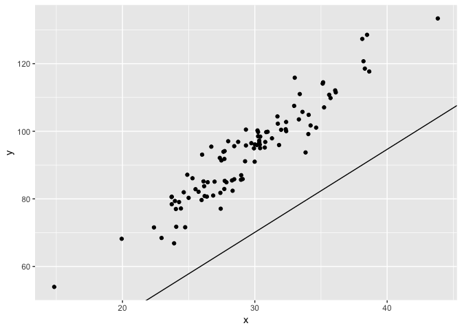
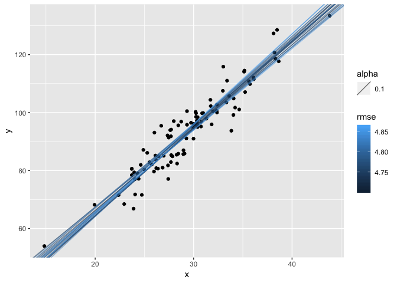

Genetic Linear Regression
================
Henry Bechtel

A solution... via evolution!
----------------------------

Importing Libraries

``` r
library(ggplot2)
library(dplyr)
```

Generating Data

``` r
x <- rnorm(100, 30, 5)
y <- 3*x + 5 + rnorm(x, 0, 5)
```

Randomly generate a set of model coefficients

``` r
beta <- runif(2, -5, 5)
```

Visualizing how our data look

``` r
data.frame(x, y) %>%
    ggplot(aes(x,y)) + 
    geom_point() +
    geom_abline(intercept=beta[1], slope = beta[2])
```



``` r
beta
```

    ## [1] -3.590564  2.456406

``` r
# Model prediction
yhat <- beta[1] + beta[2]*x

# Score
rmse <- sqrt(mean((y-yhat)^2))

rmse
```

    ## [1] 25.27904

Now with simple GA

``` r
# Generate population
total_pop <- 1000
population <- data.frame(beta0 = runif(total_pop, -100, 100), beta1 = runif(total_pop, -100, 100)) 

# Score population
population$rmse <- 0

for(generation in 1:50){
  for(i in 1:nrow(population)){
    population$rmse[i] <- sqrt(mean((y-(population$beta0[i] + population$beta1[i]*x))^2))
  }
  
  # Selection
  top_pop <- head(population[order(population$rmse),], total_pop/10)
  
  # Crossover
  population$beta0 <- sample(top_pop$beta0, total_pop, replace = TRUE)
  population$beta1 <- sample(top_pop$beta1, total_pop, replace = TRUE)
  
  # Mutation
  population$beta0 <- population$beta0 + rnorm(total_pop)
  population$beta1 <- population$beta1 + rnorm(total_pop)
}
```

Visualizing

``` r
data.frame(x, y) %>%
  ggplot(aes(x,y)) + 
  geom_point() +
  geom_abline(data = head(top_pop, 20), aes(intercept=beta0, slope = beta1, alpha = 0.1, color = rmse))
```



``` r
head(top_pop)
```

    ##        beta0    beta1     rmse
    ## 670 7.605998 2.924010 4.703048
    ## 332 9.248124 2.853227 4.712000
    ## 506 4.345562 3.009461 4.739341
    ## 320 5.471338 3.005883 4.740559
    ## 526 3.377788 3.048076 4.742082
    ## 429 3.120599 3.053852 4.752048

Let's look at the averages and standard deviations of the top betas

    ## [1] "Estimate for beta0 is:   6.30668124315131"

    ## [1] "Estimate for beta1 is:   2.95501945779995"

    ## [1] "Estimate for beta0 SE is:   3.59932735140266"

    ## [1] "Estimate for beta1 SE is:   0.147730157417931"

And now we can compare that with the output of lm

``` r
fit <- lm(y ~ x)
summary(fit)
```

    ## 
    ## Call:
    ## lm(formula = y ~ x)
    ## 
    ## Residuals:
    ##      Min       1Q   Median       3Q      Max 
    ## -12.5637  -3.1223  -0.1331   3.2483  11.9405 
    ## 
    ## Coefficients:
    ##             Estimate Std. Error t value Pr(>|t|)    
    ## (Intercept)   7.3864     3.1240   2.364     0.02 *  
    ## x             2.9233     0.1047  27.927   <2e-16 ***
    ## ---
    ## Signif. codes:  0 '***' 0.001 '**' 0.01 '*' 0.05 '.' 0.1 ' ' 1
    ## 
    ## Residual standard error: 4.745 on 98 degrees of freedom
    ## Multiple R-squared:  0.8884, Adjusted R-squared:  0.8872 
    ## F-statistic: 779.9 on 1 and 98 DF,  p-value: < 2.2e-16
